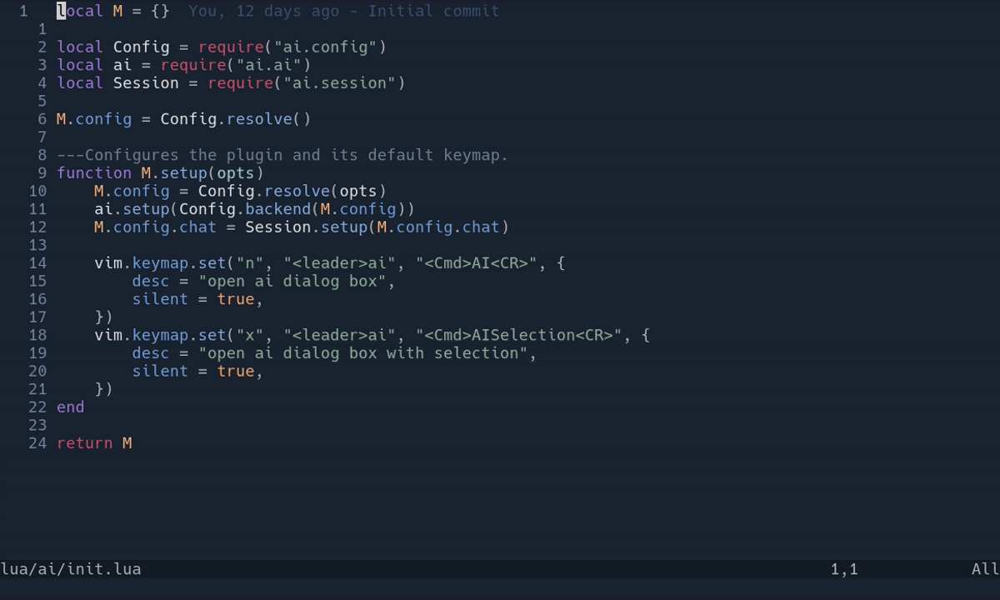

# ai.nvim

A small Neovim chat interface for [Pi](https://github.com/badlogic/pi-mono/tree/main/packages/coding-agent). It supports streaming responses, tool status, multi-turn conversations, and visual-selection context.

## Demo



## Requirements

- Neovim 0.11+
- [snacks.nvim](https://github.com/folke/snacks.nvim)
- [Pi](https://github.com/badlogic/pi-mono/tree/main/packages/coding-agent) installed and configured with an AI provider

```sh
npm install -g @mariozechner/pi-coding-agent
```

## Installation

With [lazy.nvim](https://github.com/folke/lazy.nvim), this is all you need to use the defaults:

```lua
{
  "AnonymousMorris/ai.nvim",
  dependencies = { "folke/snacks.nvim" },
  opts = {},
}
```

## Usage

| Key or command | Action |
| --- | --- |
| `<leader>ai` | Open or return to the current chat |
| `<leader>ai` in visual mode | Open chat with the selection as context |
| `<CR>` | Submit the prompt |
| `<C-c>` | Clear the prompt, or stop the session when the prompt is empty |
| `<Tab>` | Switch between the input and transcript in normal or insert mode |
| `:AI` | Open or return to the current chat |
| `:AISelection` | Add the visual selection to the chat input |
| `:AIStop` | Stop Pi and delete the current session |

Switching to the input enters insert mode automatically. The transcript and input use separate rounded windows, with a configurable contextual hint bar below them. Closing the chat window keeps the session alive. Run `:AI` to reopen it or `:AIStop` to end it.

Selection context is inserted with its file and line range. Context blocks are folded by default.

## Configuration

### Default configuration

The expanded lazy.nvim configuration below shows the plugin's actual defaults. It is equivalent to the shorter `opts = {}` setup above:

```lua
{
  "AnonymousMorris/ai.nvim",
  dependencies = { "folke/snacks.nvim" },
  opts = {
    backend = "pi",
    binary = "pi",
    extensions = true,
    skills = false,
    thinking = "off",
    auto_close = true,
    show_status = true,
    close_delay = 1000,
    chat = {
      show_hints = true,
      hints = {
        input = {
          { key = "⏎", label = "send" },
          { key = "C-c", label = "clear/stop" },
          { key = "Tab", label = "switch" },
        },
        display = {
          { key = "Tab", label = "input" },
        },
      },
      keys = {
        input = {
          ["<C-c>"] = {
            "clear_or_stop",
            mode = { "i", "n" },
            desc = "Clear input or stop AI agent",
          },
          ["<C-w>k"] = {
            "focus_display",
            desc = "Focus AI chat display",
          },
          ["<C-w><C-k>"] = {
            "focus_display",
            desc = "Focus AI chat display",
          },
          ["<Tab>"] = {
            "focus_display",
            mode = { "i", "n" },
            desc = "Focus AI chat display",
          },
        },
        display = {
          ["<C-w>j"] = {
            "focus_input",
            desc = "Focus AI chat input",
          },
          ["<C-w><C-j>"] = {
            "focus_input",
            desc = "Focus AI chat input",
          },
          ["<Tab>"] = {
            "focus_input",
            desc = "Focus AI chat input",
          },
        },
      },
    },
  },
}
```

### Direct setup

Without lazy.nvim, pass the contents of `opts` above to `require("ai").setup()`.

Pi runs in RPC mode with session persistence disabled. Extensions are enabled by default, while skills are disabled unless explicitly enabled.

Set `chat.show_hints = false` to hide the contextual hint bar. The `chat.hints.input` and `chat.hints.display` lists are rendered exactly in their configured order. Set `chat.keys = false` to disable all chat-specific keymaps, or set `chat.keys.input` or `chat.keys.display` to `false` to disable one group.

## Tests

```sh
for test in tests/*_e2e.lua; do
  nvim --headless -u NONE -l "$test" || exit 1
done
```

Set `SNACKS_NVIM` to the snacks.nvim checkout path if it is not installed at Neovim's default lazy.nvim data path.
